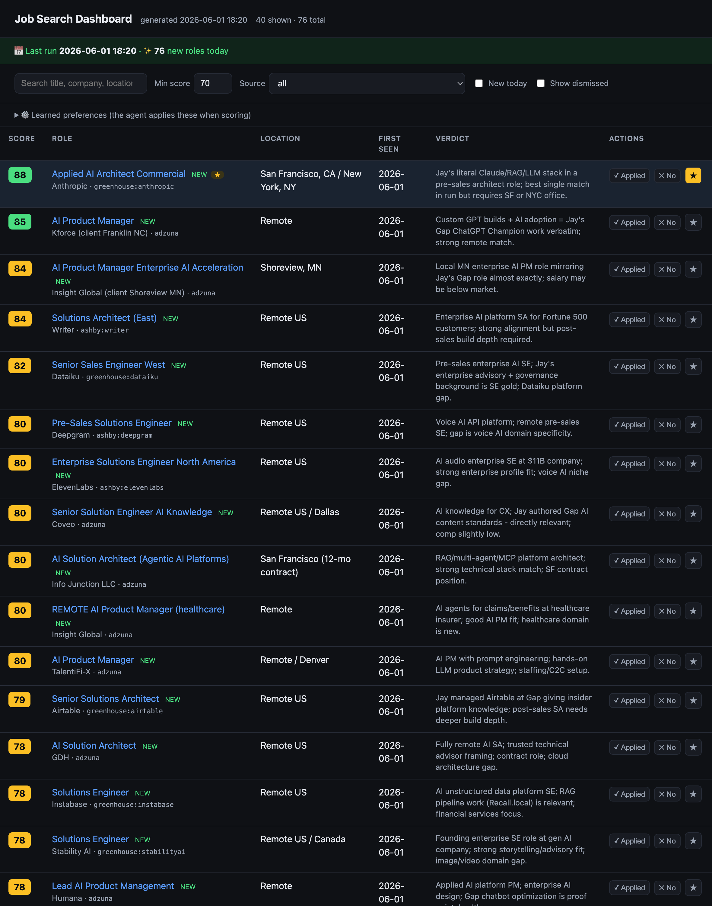

# Job Search Agent

A daily job-search agent built on **Claude Managed Agents**. Anthropic runs the agent
loop server-side; the agent pulls postings from Adzuna and 100+ company ATS boards (via
host-side custom tools), scores each against your resume, and writes a ranked digest that
feeds a local web dashboard.



## Quick start

```bash
uv sync                          # install
cp .env.example .env             # add ANTHROPIC_API_KEY + Adzuna keys (free)
uv run jobsearch-validate-boards # discover live company boards → config/ats_boards.yaml
uv run jobsearch-agent-setup     # create the agent + environment (one-time)
uv run jobsearch-agent-run       # run now → digest + dashboard
open data/digests/index.html     # the dashboard
```

It already runs automatically every day at **07:30** (see *Daily schedule* below).

---

## 🔧 Where to tweak things

Everything you'd want to change lives in **two files** — no code editing needed:

### `config/search_config.yaml`
| Setting | What it controls |
|---|---|
| `queries:` | The Adzuna searches — your target roles + locations (remote vs city). Add/remove freely. |
| `min_score_for_digest:` | Score threshold (0–100) for a posting to appear in the digest. |
| `agent_model:` | The model the agent uses. Currently `claude-sonnet-4-6` (cost-conscious). |
| `role_keywords:` | Title phrases used to filter the big company boards (e.g. "solutions engineer", "forward deployed"). Tighten or widen these. |

### Company list → `src/job_search_agent/agent/discover.py`
- Edit the `COMPANIES` list (just company **names**), then re-run
  `uv run jobsearch-validate-boards`. It re-probes Greenhouse/Lever/Ashby and rewrites
  `config/ats_boards.yaml` with whatever resolves. No agent change needed — the next run
  picks them up.
- Or keep names in a file: `uv run jobsearch-validate-boards --names companies.txt`.

### Your resume → `data/resume.md`
- After editing the resume, push it to the agent: `uv run jobsearch-agent-setup --update`
  (the resume lives in the agent's prompt, so it needs a version bump).

### Change the daily time
- Edit `Hour`/`Minute` in `scripts/com.jaydreyer.jobsearch.plist`, then reload:
  ```bash
  launchctl unload ~/Library/LaunchAgents/com.jaydreyer.jobsearch.plist
  cp scripts/com.jaydreyer.jobsearch.plist ~/Library/LaunchAgents/
  launchctl load ~/Library/LaunchAgents/com.jaydreyer.jobsearch.plist
  ```

> **After changing tools or the prompt** (not config), run `uv run jobsearch-agent-setup --update` to push a new agent version.

---

## 💾 What persists (nothing disappears overnight)

Everything is on your disk or saved server-side — a reboot or a new day changes nothing:

| Thing | Where it lives | Survives? |
|---|---|---|
| The agent + environment | Anthropic servers; IDs saved in `.env` (`AGENT_ID`/`ENVIRONMENT_ID`) | ✅ persistent, versioned |
| Your keys & settings | `.env`, `config/` (on disk) | ✅ |
| Company list | `config/ats_boards.yaml` (on disk) | ✅ |
| **Every day's results** | `data/digests/YYYY-MM-DD-digest.{md,csv}` — one pair per day | ✅ full history kept |
| The dashboard | `data/digests/index.html` — rebuilt each run from **all** past CSVs | ✅ accumulates |

The dashboard aggregates every digest ever produced, dedupes by company+title, stamps
each role with the date it was **first seen**, and badges anything new today as **NEW** —
so you get day-over-day tracking for free. To rebuild it manually any time:
`uv run jobsearch-dashboard`.

---

## 🧠 Teaching it your preferences (feedback)

The agent learns from your decisions. Run the interactive dashboard:

```bash
uv run jobsearch-serve     # opens localhost:8137 — bookmark this
```

Each row has **✓ Applied / ✕ No / ★** buttons, plus a "Learned preferences" box.
Everything saves to `data/feedback.json` (you own it). On the next run:

- **Applied** and **Not-interested** roles are filtered out *before the agent scores
  them* — a hard guarantee they never resurface (and it saves tokens).
- **★ Starred** roles pin to the top of your dashboard.
- **Preferences** (e.g. *"prefer hands-on AI eng over pure sales"*, *"no SF
  relocation"*) are injected into the agent's scoring so rankings sharpen over time.

> Open `index.html` directly and it's read-only (a banner reminds you). Run
> `jobsearch-serve` for the clickable version. Same data either way.

You can also mark from the terminal: `uv run jobsearch-feedback applied "OpenAI" "Solutions Engineer, Pre-Sales"`.

## Daily schedule (already installed)

Runs via macOS `launchd` at 07:30 daily. Logs: `data/digests/run.log`.

```bash
launchctl list | grep jobsearch                    # confirm it's loaded
launchctl start com.jaydreyer.jobsearch            # run it right now (paid)
launchctl unload ~/Library/LaunchAgents/com.jaydreyer.jobsearch.plist  # disable
```

Each morning the digest + dashboard refresh on their own — just reload your bookmarked
`data/digests/index.html`.

---

## Cloud run (optional — laptop-independent)

The local `launchd` schedule only fires when your Mac is awake. To run in the cloud
instead, `.github/workflows/daily.yml` runs the agent on GitHub Actions. It stays
inert until you add repo secrets (scheduled runs no-op cleanly until then):

```bash
gh secret set ANTHROPIC_API_KEY   # paste your key
gh secret set ADZUNA_APP_ID
gh secret set ADZUNA_APP_KEY
gh secret set AGENT_ID
gh secret set ENVIRONMENT_ID
gh secret set RESUME_MD < data/resume.md   # resume isn't in the repo; pass it as a secret
```

Then enable the schedule (it's already in the workflow) or trigger a manual run from the
Actions tab. The run uploads the digest as a workflow **artifact**.

> ⚠️ **Privacy:** on a **public** repo, artifacts are downloadable by anyone — so your
> daily matches would be visible. For private results either (a) make the repo private
> (`gh repo edit --visibility private`), or (b) swap the upload step for an email step.
> Feedback (applied/dismissed/preferences) still lives on your local machine, so cloud
> runs won't know about it unless you also sync `data/feedback.json`.

## How it works

```
  setup (once):  agents.create() → AGENT_ID         ┌─ Anthropic (agent loop, sonnet) ─┐
  run (daily):   sessions.create() → stream  ───────│ reads resume (cached)            │
                                                     │ calls custom tools ──────────────┼─┐
  Orchestrator (your machine) answers tool calls:    │ scores vs resume                 │ │
   • search_jobs_adzuna   → Adzuna API (your key)    │ writes digest.md/.csv ───────────┼─┘
   • fetch_all_company_boards → 102 ATS boards ◀─────┘   to /mnt/session/outputs
   • downloads digest → builds dashboard
```

Custom tools run **host-side**, so your Adzuna key never enters Anthropic's container.
The breadth tool fetches all boards in parallel (~3s), filters to your roles + US/remote,
dedupes, and hands the agent a bounded shortlist — so 100+ companies don't blow context.

> LinkedIn / Ladders aren't scraped (ToS + account risk). The in-Claude Indeed/LinkedIn
> MCP connectors can't be reached from a standalone scheduled agent.

## Commands

| Command | Does |
|---|---|
| `uv run jobsearch-validate-boards` | Discover live company boards → `config/ats_boards.yaml` |
| `uv run jobsearch-agent-setup` | Create the agent (one-time); `--update` to push changes |
| `uv run jobsearch-agent-run` | Run a session now → digest + dashboard |
| `uv run jobsearch-agent-dryrun` | Cheap data-path check (no agent/session, ~free) |
| `uv run jobsearch-dashboard` | Rebuild `index.html` from existing digests |
| `uv run jobsearch-status` | Did today's run happen? Schedule health + latest digest |
| `uv run jobsearch-serve` | Interactive dashboard at localhost:8137 (clickable feedback) |
| `uv run jobsearch-feedback …` | Mark jobs from the terminal (applied/dismiss/star/pref/list) |
| `uv run jobsearch run` | Simpler local-only pipeline (no managed agent) |
